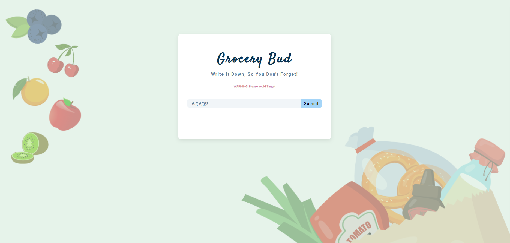

# Grocery Bud

## Table of contents

- [Overview](#overview)
  - [The challenge](#the-challenge)
  - [Screenshot](#screenshot)
  - [Links](#links)
- [My process](#my-process)
  - [Built with](#built-with)
  - [What I learned](#what-i-learned)
  - [Continued development](#continued-development)
  - [Useful resources](#useful-resources)

## Overview
Created a functional grocery list with JavaScript

### The challenge

Users should be able to:

-	Add grocery items to the list and it should appear
-	Edit the grocery item
-   Remove items
-   Clear list

### Screenshot

### Links

- Solution URL: https://github.com/Jud1th1/grocery-bud
- Live Site URL: https://clever-grocery-bud.netlify.app/

## My process
-	I followed along with the FreeCodeCamp Youtube tutorial to layout out my html, js and css. 
-	We set up the JavaScript file by selecting the items we would be using from the html doc, setting up our variables and creating classes to store the numbers that would be used. 
-   Afterwards we added event listeners and functions for what would happen when a button was pressed, such as the trash icon, submit button, etc. 
-	I had to define the functions that javascript would handle, such as adding items, displaying alerts if you leave the text field empty and try to submit, alerts for removing items, functions to edit items, clear items and delete.
-	We added a local storage to keep track of the items as well as revert to a default state when cleared
-   I added my own design elements such as a background image, new font colors and shadow for my box.

### Built with

- HTML
- CSS 
- Javascript
- Responsive mobile & web design

### What I learned

-	This was another great practice at using JavaScript, I learned about how to set up functions for each item (my buttons and alerts) I wanted to set in my webpage that the user could interact with. What I really took away from this was how to edit and clear a text element, that  I know I will be using in future. 

### Continued development
-	Next I would love to learn about how to add a quantity feature to an app like this to help users keep track of how many of each item they need. 

### Useful resources

- Free Code Camp Youtube tutorial- https://www.youtube.com/watch?v=3PHXvlpOkf4&t=22802s

